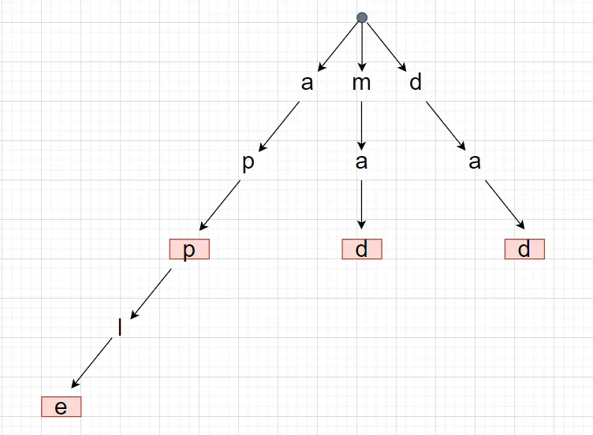
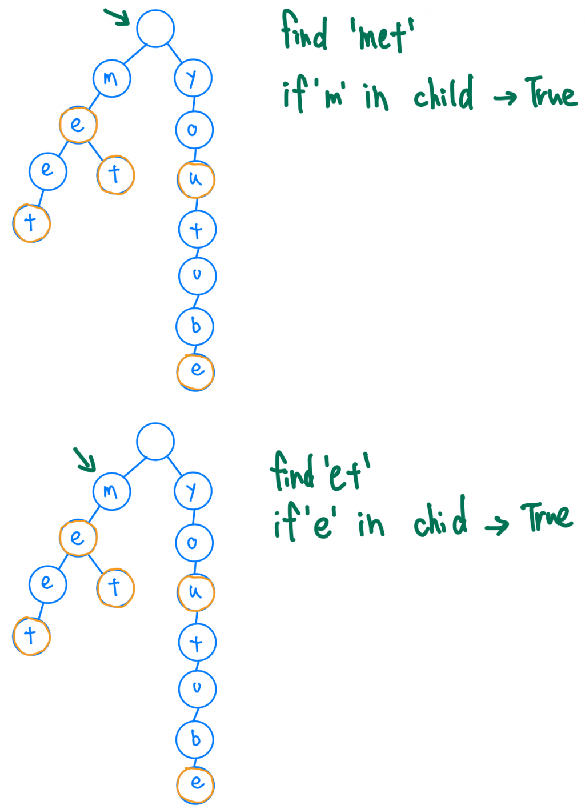

# Trie

Trie又稱作prefix tree, 非常適合用在字串搜尋的時候，例如搜尋列的auto complete功能．
Trie由一連串的節點組成，一個節點就是一個字母，一連串的節點就代表字串，在字串結尾的那個節點，會需要標注此字串的終點在這個節點



```python
class TrieNode:
    def __init__(self):
        self.children = [None] * 26
        self.isEnd = False
```

## 用途
- 找出每個有特定前綴詞的字詞
```python
def startsWith(self, prefix: str) -> bool:
    node = self.root
    for char in prefix:
        index = ord(char) - ord('a')
        if not node.children[index]:     
            return False
        node = node.children[index]

    return True 
```


- 按照字典順序列出所有字串

## 優點
- 使用O(1)的時間複雜度查找字元是否在字典中，所以只要是查照一樣長度的關鍵字，時間複雜度就固定是O(n), n=字串長度


雖然hash table也能達到，但若發生碰撞，時間複雜度就會變成O(n)
以下就是碰撞的例子，雖然是不同字串，但是算出來的hash值相同，就得要逐一比對
```
  hash("cat") = 5

  桶 5: [("cat", ✓), ("act", ✓), ("tac", ✓)]  ← 碰撞！
        需要逐一比對
```

- 如果儲存的資料有相同前綴詞，hash table 會比trie消耗更多空間，因為trie的節點一個只儲存一個字元，所以相同的前綴詞可以共用節點，不必像hash table一樣一定要儲存完整的字串，導致重複儲存


ref:
https://ithelp.ithome.com.tw/articles/10294596
https://medium.com/@r844312/%E4%BD%BF%E7%94%A8%E8%B3%87%E6%96%99%E7%B5%90%E6%A7%8B-trie-%E4%BE%86%E5%AF%A6%E4%BD%9C-autocomplete-b1089babfb26